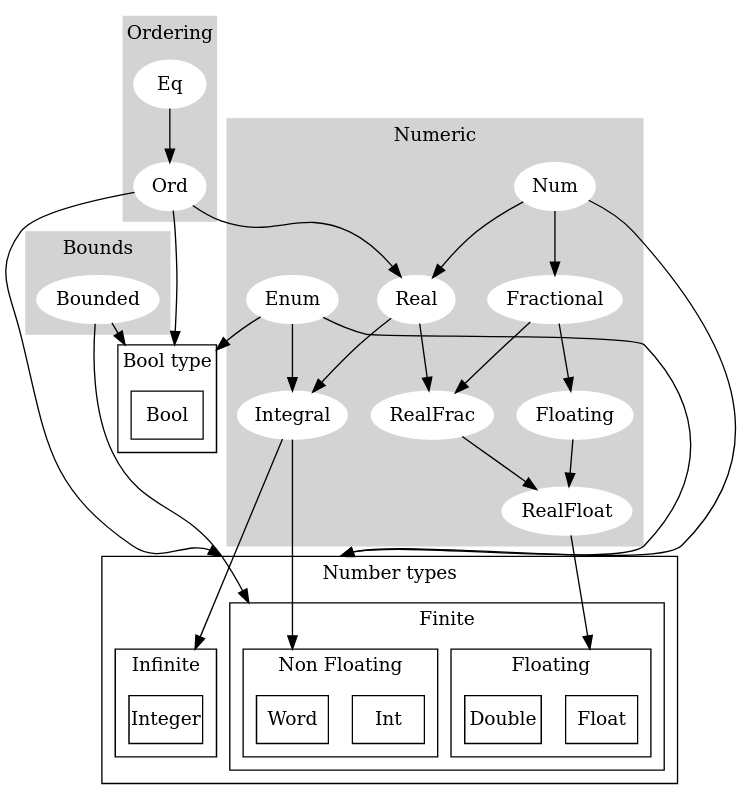
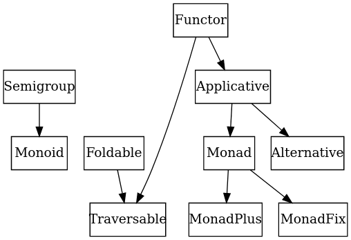

# [Haskell](http://www.haskell.org/), an advanced, purely functional programming language

A ***mixture of quick reference guide and Haskell tutorial*** full of external references [^1] [^2].

[^1]: Based on [GHC](https://www.haskell.org/ghc/) (The Glasgow Haskell Compiler), a state-of-the-art, open source, compiler and interactive environment for the functional language Haskell

[^2]: Using [version 9.2.2](https://downloads.haskell.org/ghc/latest/docs/html/users_guide/index.html) of GHC

This is a WORK IN PROGRESS!

## Preface

> “Some half dozen persons have written technically on combinatory logic, and most of these, including ourselves, have published something erroneous. Since some of our fellow sinners are among the most careful and competent logicians on the contemporary scene, we regard this as evidence that the subject is refractory. Thus fullness of exposition is necessary for accuracy; and excessive condensation would be false economy here, even more than it is ordinarily.”
>
> [Haskell B. Curry](https://en.wikipedia.org/wiki/Haskell_Curry) and [Robert Feys](https://en.wikipedia.org/wiki/Robert_Feys)
> in the Preface to Combinatory Logic [\[3\]](https://www.haskell.org/onlinereport/haskell2010/haskellli3.html#Xcurry&feys:book), May 31, 1956

[^3]: H.K. Curry and R. Feys. Combinatory Logic. North-Holland Pub. Co., Amsterdam, 1958

## History

Read paper ["A History of Haskell: Being Lazy with Class"](https://www.microsoft.com/en-us/research/wp-content/uploads/2016/07/history.pdf) from 2007.

From its abstract:
`This paper describes the history of Haskell, including its genesis and principles, technical contributions, implementations and tools, and applications and impact.`

Also [this video](https://www.youtube.com/watch?v=re96UgMk6GQ) from 2017 where [Symon Peyton Jones](https://www.microsoft.com/en-us/research/people/simonpj/) discusses Haskell’s birth and evolution

### Inception

In a meeting held at the conference on Functional Programming Languages and Computer Architecture (FPCA ’87) in Portland, Oregon in September of 1987, it was decided that a committee should be formed to design a much needed common language for a ***purely functional programming languages***

The committee’s primary goal was to design a language that satisfied these constraints:

- It should be completely described via the publication of a ***formal syntax and semantics***.
- It should be suitable for ***teaching, research, and applications, including building large systems***.
- It should be ***freely available***. Anyone should be permitted to implement the language and distribute it to whomever they please.
- It should be based on ideas that enjoy a wide consensus.
- It should reduce unnecessary diversity in functional programming languages.

[This documents](https://wiki.haskell.org/Language_and_library_specification) describes the results of that (and subsequent) committee’s efforts: a purely functional programming language called Haskell, ***named after the logician Haskell B. Curry whose work provides the logical basis for much of ours***.

Paper with a static semantics for a large subset of Haskell, including giving a translations into a language without overloading:
https://www.microsoft.com/en-us/research/wp-content/uploads/1991/03/A-Static-Semantics-for-Haskell_small.pdf

#### TL;DR;

From this short post full of irony: [A Brief, Incomplete, and Mostly Wrong History of Programming Languages](https://james-iry.blogspot.com/2009/05/brief-incomplete-and-mostly-wrong.html).

`1990 - A committee formed by Simon Peyton-Jones, Paul Hudak, Philip Wadler, Ashton Kutcher, and People for the Ethical Treatment of Animals creates Haskell, a pure, non-strict, functional language. Haskell gets some resistance due to the complexity of using monads to control side effects. Wadler tries to appease critics by explaining that "a monad is a monoid in the category of endofunctors, what's the problem?"`

## Why?

There is an old but still relevant paper about [Why Functional Programming Matters](http://www.cse.chalmers.se/~rjmh/Papers/whyfp.html) by John Hughes. More recently, Sebastian Sylvan wrote an article about [Why Haskell Matters](https://wiki.haskell.org/Why_Haskell_matters). 

### Purpose

A [+10 years old funny video](https://www.youtube.com/watch?v=iSmkqocn0oQ) of what Haskell wants to achieve and the path taken to achieve it

## Main Features

> Haskell is a general purpose, purely functional programming language incorporating many recent innovations in programming language design. Haskell provides ***higher-order functions***, ***non-strict semantics***, ***static polymorphic typing***, ***user-defined algebraic datatypes***, ***pattern-matching***, ***list comprehensions***, a module system, a monadic I/O system, and a rich set of primitive datatypes, including lists, arrays, arbitrary and fixed precision integers, and floating-point numbers. Haskell is both the culmination and solidification of many years of research on non-strict functional languages.
>
> [Haskell 2010 Report - Chapter 1 - Introduction](https://www.haskell.org/onlinereport/haskell2010/haskellch1.html#x6-90001)

- Purely functional
  - Every function in Haskell is a function in the mathematical sense (i.e., "pure"). Even side-effecting IO operations are but a description of what to do, produced by pure code. There are no statements or instructions, only expressions which cannot mutate variables (local or global) nor access state like time or random numbers.
- Statically typed
  - Every expression in Haskell has a type which is determined at compile time. All the types composed together by function application have to match up. If they don't, the program will be rejected by the compiler. Types become not only a form of guarantee, but a language for expressing the construction of programs.
    - See [Type checker and type inference in action.](doc/extension/MultiParamTypeClasses.md#Type-checker-and-type-inference-in-action).
- Type inference
  - You don't have to explicitly write out every type in a Haskell program. Types will be inferred by unifying every type bidirectionally. However, you can write out types if you choose, or ask the compiler to write them for you for handy documentation.
    - See [Type checker and type inference in action.](doc/extension/MultiParamTypeClasses.md#Type-checker-and-type-inference-in-action).
- Lazy
  - Functions don't evaluate their arguments. This means that programs can compose together very well, with the ability to write control constructs (such as if/else) just by writing normal functions. The purity of Haskell code makes it easy to fuse chains of functions together, allowing for performance benefits.
- Concurrent
  - Haskell lends itself well to concurrent programming due to its explicit handling of effects. Its flagship compiler, GHC, comes with a high-performance parallel garbage collector and light-weight concurrency library containing a number of useful concurrency primitives and abstractions.
- Packages
  - Open source contribution to Haskell is very active with a wide range of packages available on the public package servers.

# Lambda calculus

Desugared Haskell is essentially a slightly sugared variant of the lambda calculus with a straightforward denotational semantics.

A little theory about how it all started: [The beginnings of Theoretical Computer Science](doc/Lambda.md).

# Prelude

We will start first showing with examples the standard built-in datatypes and classes in Haskell.

https://www.haskell.org/onlinereport/haskell2010/haskellch6.html#x13-1160006

Two thing that you may need to understand first:

## 1. Values and types

An expression evaluates to a value and has a static type. Values and types are not mixed in Haskell. However, the type system allows user-defined datatypes of various sorts, and permits not only parametric polymorphism (using a traditional Hindley-Milner type structure) but also ad hoc polymorphism, or overloading (using type classes).

## 2. Namespaces

 There are six kinds of names in Haskell:
- Those for values:
  - Variables
  - Constructors
- Those for entities related to the type system:
  - Type variables
  - Type constructors
  - Type classes
- Those for module
  - Module names

There are two constraints on naming: Names for variables and type variables are identifiers beginning with lowercase letters or underscore; the other four kinds of names are identifiers beginning with uppercase letters. An identifier must not be used as the name of a type constructor and a class in the same scope. These are the only constraints; for example, Int may simultaneously be the name of a module, class, and constructor within a single scope.

## Built-in

The basic types and classes that are in scope by default in every Haskell file are described in [Prelude](doc/Prelude.md)
- [Lists](doc/Lists.md)
- [Strings](doc/Strings.md)
- [Fractional Numbers](doc/NumbersFractional.md)



Set based view:
<pre>Eq         = {Float, Double, Int, Word, Integer, Bool}</pre>
<pre>Ord        = {Float, Double, Int, Word, Integer, Bool}</pre>
<pre>Enum       = {Float, Double, Int, Word, Integer, Bool}</pre>
<pre>Bounded    = {Float, Double, Int, Word,          Bool}</pre>
<pre>Num        = {Float, Double, Int, Word, Integer, Bool}</pre>
<pre>Integral   = {               Int, Word, Integer      }</pre>
<pre>Real       = {Float, Double, Int, Word, Integer      }</pre>
<pre>Fractional = {Float, Double                          }</pre>
<pre>Floating   = {Float, Double                          }</pre>
<pre>RealFrac   = {Float, Double                          }</pre>
<pre>RealFloat  = {Float, Double                          }</pre>

## Custom Prelude

The Prelude is imported by default or with ```import Prelude``` but the default Prelude can be disabled using ```-XNoImplicitPrelude``` GHC flag, this allows us to replace the default entirely with a custom prelude. Some projects roll their own Prologue.hs module in replacement.

```
{-# LANGUAGE NoImplicitPrelude #-}
```

You get an idea of how customizable source code in Haskell can be.

# IO

https://www.haskell.org/onlinereport/haskell2010/haskellch7.html#x14-1420007

# Language formal definition

The Haskell reports define "the syntax for Haskell programs and an informal abstract semantics for the meaning of such programs" but not "the ways in which Haskell programs are to be manipulated, interpreted, compiled, etc".

## [Haskell’s lexical structure](https://www.haskell.org/onlinereport/haskell2010/haskellch2.html#x7-140002)

## [Expressions](https://www.haskell.org/onlinereport/haskell2010/haskellch3.html#x8-220003)

## [Declarations](https://www.haskell.org/onlinereport/haskell2010/haskellch4.html#x10-620004)

## [Modules](https://www.haskell.org/onlinereport/haskell2010/haskellch5.html#x11-980005)

## Class hierarchy



### Monoids

For an easy start see [Monoid](doc/Monoid.md), you won't be using them much but helps undertanding the rest.

### Applicative Functors

See [subpage](doc/ApplicativeFunctor.md)

### Monads

See [subpage](doc/Monad.md)

Best publication about monads is this one that focuses on explaining the “bits round the edges” of Haskell programs:
[Tackling the awkward squad: monadic input/output, concurrency, exceptions, and foreign-language calls in Haskell](https://www.microsoft.com/en-us/research/publication/tackling-awkward-squad-monadic-inputoutput-concurrency-exceptions-foreign-language-calls-haskell/)

### Example

A little [example](doc/MonadExample.md) showing how an instance of [Monoid](doc/Monoid.md), [Applicative](doc/ApplicativeFunctor.md) and [Monad](doc/Monad.md) is built.

## Datatype extensions

### Multi-parameter type classes

```haskell
{-# LANGUAGE MultiParamTypeClasses #-}
{-# LANGUAGE FunctionalDependencies #-}

class Collection c a where
        union :: c a -> c a -> c a
        ...

class Coerce a b c | a b -> c where
        add :: a -> b -> c
        ...
```

IMO this extension was superseded by the type families extension but the reasons
for this may provide some hindsight on the type system and the type inference
system.

See [Multi-parameter type classes](doc/extension/MultiParamTypeClasses.md)

### Phantom types (GADTs)

See [Monad](doc/Phantom.md)

# Further reading

- [What I Wish I Knew When Learning Haskell](http://dev.stephendiehl.com/hask/)
  - PDF Version: http://dev.stephendiehl.com/fun/WYAH.pdf
- [Introduction to functional programming](https://learn.saylor.org/mod/book/view.php?id=33044)
- [Haskell 2010 Language Report](https://www.haskell.org/onlinereport/haskell2010/)

# TODO

# Category theory
[Categories for the Working Mathematician](https://link.springer.com/book/10.1007/978-1-4757-4721-8)

# Others

seL4: Formal Verification of an OS Kernel
https://www.sigops.org/s/conferences/sosp/2009/papers/klein-sosp09.pdf

Maybe explain some of this: https://stackoverflow.com/questions/36274369/what-are-some-types-that-discriminate-between-categories
