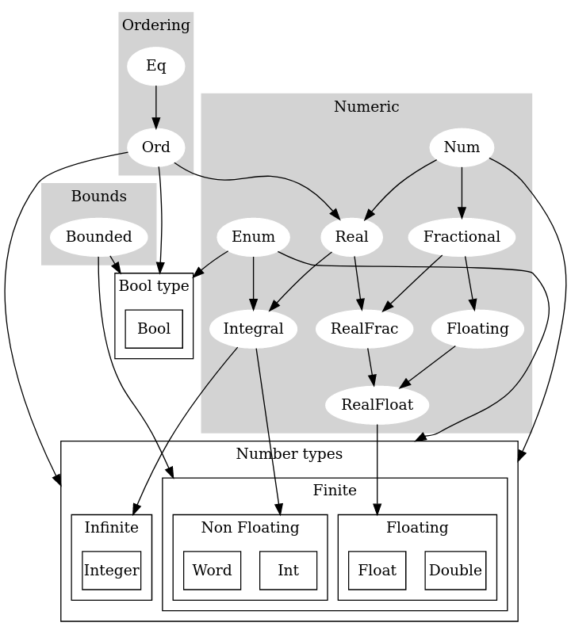

This is a WORK IN PROGRESS!

# [Haskell](http://www.haskell.org/), an advanced, purely functional programming language

A ***mixture of quick reference guide and Haskell tutorial*** full of external references [^1] [^2]

[^1]: Based on [GHC](https://www.haskell.org/ghc/) (The Glasgow Haskell Compiler), a state-of-the-art, open source, compiler and interactive environment for the functional language Haskell

[^2]: Using [version 9.2.2](https://downloads.haskell.org/ghc/latest/docs/html/users_guide/index.html) of GHC

## Preface

> “Some half dozen persons have written technically on combinatory logic, and most of these, including ourselves, have published something erroneous. Since some of our fellow sinners are among the most careful and competent logicians on the contemporary scene, we regard this as evidence that the subject is refractory. Thus fullness of exposition is necessary for accuracy; and excessive condensation would be false economy here, even more than it is ordinarily.”
>
> [Haskell B. Curry](https://en.wikipedia.org/wiki/Haskell_Curry) and [Robert Feys](https://en.wikipedia.org/wiki/Robert_Feys)
> in the Preface to Combinatory Logic [\[3\]](https://www.haskell.org/onlinereport/haskell2010/haskellli3.html#Xcurry&feys:book), May 31, 1956

[^3]: H.K. Curry and R. Feys. Combinatory Logic. North-Holland Pub. Co., Amsterdam, 1958

### History
Read paper ["A History of Haskell: Being Lazy with Class"](https://www.microsoft.com/en-us/research/wp-content/uploads/2016/07/history.pdf) from 2007

From its abstract:
`This paper describes the history of Haskell, including its genesis and principles, technical contributions, implementations and tools, and applications and impact.`

Also [this video](https://www.youtube.com/watch?v=re96UgMk6GQ) from 2017 where [Symon Peyton Jones](https://www.microsoft.com/en-us/research/people/simonpj/) discusses Haskell’s birth and evolution

#### Inception

In a meeting held at the conference on Functional Programming Languages and Computer Architecture (FPCA ’87) in Portland, Oregon in September of 1987, it was decided that a committee should be formed to design a much needed common language for a ***purely functional programming languages***

The committee’s primary goal was to design a language that satisfied these constraints:

- It should be completely described via the publication of a ***formal syntax and semantics***.
- It should be suitable for ***teaching, research, and applications, including building large systems***.
- It should be ***freely available***. Anyone should be permitted to implement the language and distribute it to whomever they please.
- It should be based on ideas that enjoy a wide consensus.
- It should reduce unnecessary diversity in functional programming languages.

[This documents](https://wiki.haskell.org/Language_and_library_specification) describes the results of that (and subsequent) committee’s efforts: a purely functional programming language called Haskell, ***named after the logician Haskell B. Curry whose work provides the logical basis for much of ours***.

Paper with a static semantics for a large subset of Haskell, including giving a translations into a language without overloading:
https://www.microsoft.com/en-us/research/wp-content/uploads/1991/03/A-Static-Semantics-for-Haskell_small.pdf

##### TL;DR;

From this short post full of irony: [A Brief, Incomplete, and Mostly Wrong History of Programming Languages](https://james-iry.blogspot.com/2009/05/brief-incomplete-and-mostly-wrong.html).

`1990 - A committee formed by Simon Peyton-Jones, Paul Hudak, Philip Wadler, Ashton Kutcher, and People for the Ethical Treatment of Animals creates Haskell, a pure, non-strict, functional language. Haskell gets some resistance due to the complexity of using monads to control side effects. Wadler tries to appease critics by explaining that "a monad is a monoid in the category of endofunctors, what's the problem?"`

### Why?

There is an old but still relevant paper about [Why Functional Programming Matters](http://www.cse.chalmers.se/~rjmh/Papers/whyfp.html) by John Hughes. More recently, Sebastian Sylvan wrote an article about [Why Haskell Matters](https://wiki.haskell.org/Why_Haskell_matters). 

#### Purpose

A [+10 years old funny video](https://www.youtube.com/watch?v=iSmkqocn0oQ) of what Haskell wants to achieve and the path taken to achieve it

### Main Features

- Purely functional
  - Every function in Haskell is a function in the mathematical sense (i.e., "pure"). Even side-effecting IO operations are but a description of what to do, produced by pure code. There are no statements or instructions, only expressions which cannot mutate variables (local or global) nor access state like time or random numbers.
- Statically typed
  - Every expression in Haskell has a type which is determined at compile time. All the types composed together by function application have to match up. If they don't, the program will be rejected by the compiler. Types become not only a form of guarantee, but a language for expressing the construction of programs.
- Type inference
  - You don't have to explicitly write out every type in a Haskell program. Types will be inferred by unifying every type bidirectionally. However, you can write out types if you choose, or ask the compiler to write them for you for handy documentation.
- Lazy
  - Functions don't evaluate their arguments. This means that programs can compose together very well, with the ability to write control constructs (such as if/else) just by writing normal functions. The purity of Haskell code makes it easy to fuse chains of functions together, allowing for performance benefits.
- Concurrent
  - Haskell lends itself well to concurrent programming due to its explicit handling of effects. Its flagship compiler, GHC, comes with a high-performance parallel garbage collector and light-weight concurrency library containing a number of useful concurrency primitives and abstractions.
- Packages
  - Open source contribution to Haskell is very active with a wide range of packages available on the public package servers.

## Prelude

The basic types and clasess that are in scope by default in every Haskell file are described in [Prelude](doc/Prelude.md)
- [Lists](doc/Lists.md)
- [Strings](doc/Strings.md)
- [Fractional Numbers](doc/NumbersFractional.md)



### Custom Prelude

The Prelude is imported by default or with ```import Prelude``` but the default Prelude can be disabled using ```-XNoImplicitPrelude``` GHC flag, this allows us to replace the default entirely with a custom prelude. Some projects roll their own Prologue.hs module in replacement.

```
{-# LANGUAGE NoImplicitPrelude #-}
```
## Lambda calculus


## Class hierarchy


### Monoids

For an easy start see [Monoid](doc/Monoid.md), you won't be using them much but helps undertanding the rest.

### Applicative Functors

See [subpage](doc/ApplicativeFunctor.md)

### Monads

See [subpage](doc/Monad.md)

Best publication about monads is this one that focuses on explaining the “bits round the edges” of Haskell programs:
[Tackling the awkward squad: monadic input/output, concurrency, exceptions, and foreign-language calls in Haskell](https://www.microsoft.com/en-us/research/publication/tackling-awkward-squad-monadic-inputoutput-concurrency-exceptions-foreign-language-calls-haskell/)

## Datatype extensions

### Phantoms

See [Monad](doc/Phantom.md)

# Further reading

- [What I Wish I Knew When Learning Haskell ](http://dev.stephendiehl.com/hask/)
- http://dev.stephendiehl.com/fun/WYAH.pdf

# TODO

# Category theory
[Categories for the Working Mathematician](https://link.springer.com/book/10.1007/978-1-4757-4721-8)

# Others

seL4: Formal Verification of an OS Kernel
https://www.sigops.org/s/conferences/sosp/2009/papers/klein-sosp09.pdf

Maybe explain some of this: https://stackoverflow.com/questions/36274369/what-are-some-types-that-discriminate-between-categories
